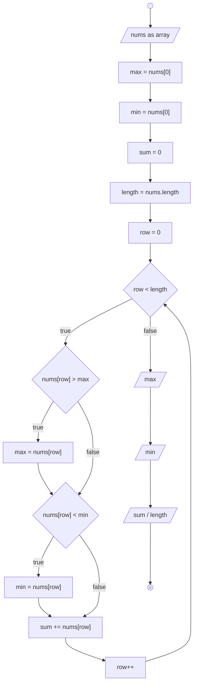

# Javascript 4

## Program untuk menghitung Max, Min, Average

### Flowchart 

```mermaid
flowchart TD
    Start@{ shape: start }
    InputNums@{ shape: lean-r, label: "nums as array" }
    InitMax@{ shape: rect, label: "max = nums[0]" }
    InitMin@{ shape: rect, label: "min = nums[0]" }
    InitSum@{ shape: rect, label: "sum = 0" }
    InitLength@{ shape: rect, label: "length = nums.length" }
    InitRow@{ shape: rect, label: "row = 0" }
    RowControl@{ shape: decision, label: "row < length" }
    MaxControl@{ shape: decision, label: "nums[row] > max" }
    ChangeMax@{ shape: rect, label: "max = nums[row]" }
    MinControl@{ shape: decision, label: "nums[row] < min" }
    ChangeMin@{ shape: rect, label: "min = nums[row]"}
    AddToSum@{ shape: rect, label: "sum += nums[row]" }
    IncrRow@{ shape: rect, label: "row++" }
    OutputMax@{ shape: lean-r, label: "max" }
    OutputMin@{ shape: lean-r, label: "min" }
    OutputAvg@{ shape: lean-r, label: "sum / length" }
    End@{ shape: stop }

    Start --> InputNums --> InitMax --> InitMin --> InitSum --> InitLength --> InitRow --> RowControl

    RowControl --true--> MaxControl

    MaxControl --true--> ChangeMax --> MinControl
    MaxControl --false--> MinControl

    MinControl --true--> ChangeMin --> AddToSum
    MinControl --false--> AddToSum

    AddToSum --> IncrRow --> RowControl

    RowControl --false--> OutputMax --> OutputMin --> OutputAvg --> End
```